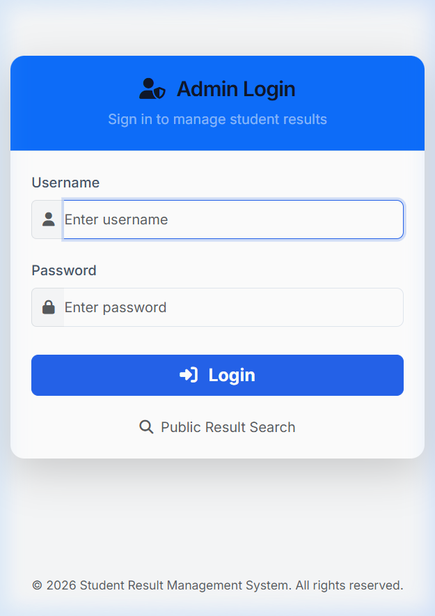
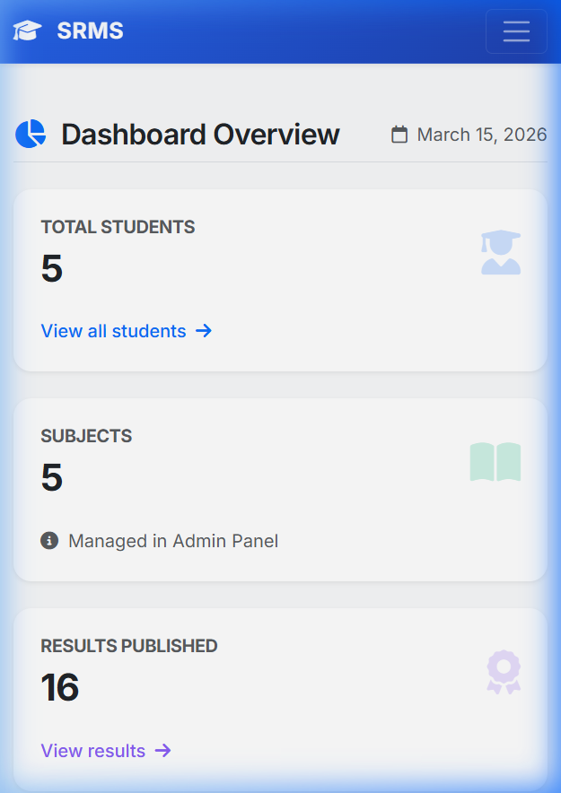
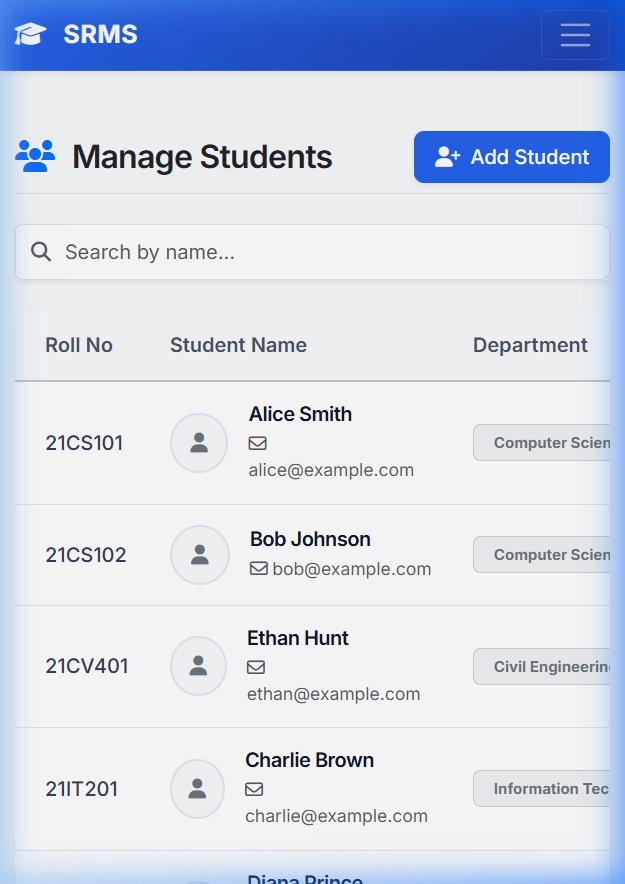
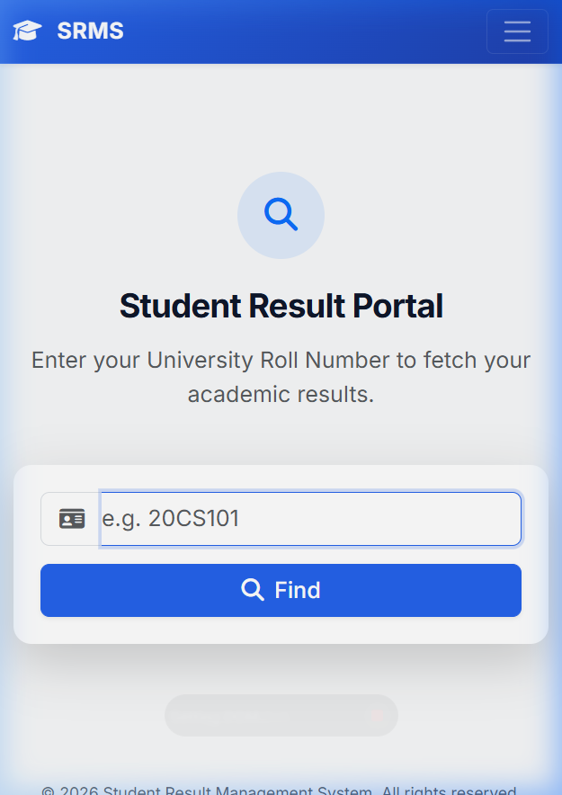

# Student Result Management System

Hey there! This is a simple Django project I made to manage student results. It lets you add students, manage subjects, and enter marks for different semesters. There's also a public page where students can check their results using their roll number.

## Screenshots






## What's inside

I used standard web tech for the frontend (HTML, CSS, Bootstrap, JS) and Django/Python for the backend. The database is SQLite by default, so it's really easy to run without any weird setup.

Main features:
- Admin dashboard to manage everything securely
- Add, edit, or delete student info (with profile pictures!)
- Manage subjects and enter grades
- Public result checking page for the students
- Search and filter tools

## Project Structure

```
student-result-management/
├── core/
│   ├── manage.py
│   ├── create_superuser.py
│   ├── populate_dummy_data.py
│   └── core/
│       ├── settings.py
│       ├── urls.py
│       ├── wsgi.py
│       └── asgi.py
├── results/
│   ├── models.py
│   ├── views.py
│   ├── urls.py
│   ├── admin.py
│   ├── apps.py
│   └── templates/
│       └── results/
│           ├── login.html
│           ├── dashboard.html
│           ├── student_list.html
│           ├── student_form.html
│           ├── result_list.html
│           ├── result_form.html
│           └── view_result.html
├── templates/
│   ├── base.html
│   └── static/
│       ├── css/style.css
│       └── js/script.js
├── screenshots/
├── requirements.txt
├── .gitignore
└── README.md
```

## How to run it on your machine

1. Clone this repo to your PC.
2. Open CMD or your terminal and go into the `core` folder inside the project.
3. It's usually a good idea to create a virtual environment:
   ```cmd
   python -m venv env
   env\Scripts\activate
   ```
4. Install the required packages:
   ```cmd
   pip install -r ..\requirements.txt
   pip install Pillow
   ```
5. Set up the database and create your admin account:
   ```cmd
   python manage.py makemigrations
   python manage.py migrate
   python manage.py createsuperuser
   ```
6. Finally, start it up:
   ```cmd
   python manage.py runserver
   ```
   Now you can open `http://127.0.0.1:8000` in your browser.

## Pushing to GitHub

If you want to push your own copy, you can just do the usual git commands from the project root folder:

```cmd
git add .
git commit -m "Update stuff"
git branch -M main
git push -u origin main
```

## Developer

**Rupesh K**
- GitHub: [Rupeshkummari](https://github.com/Rupeshkummari)
- LinkedIn: [kummari-rupesh-76325a251](https://linkedin.com/in/kummari-rupesh-76325a251)
- Drop an email: rupeshkummari223@gmail.com
